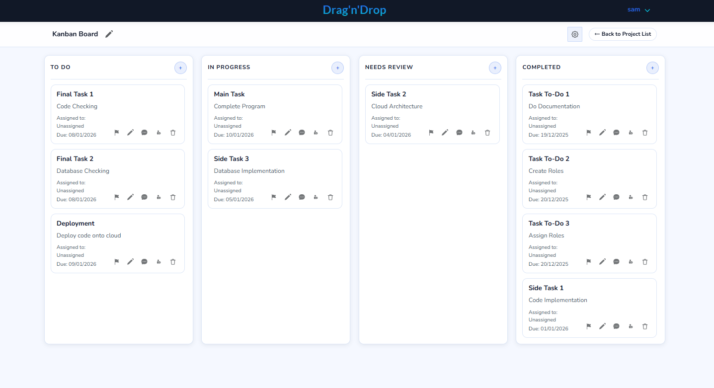

# Drag'n'Drop
Drag'n'Drop is a Kanban Board-style project manager. This full-stack web application makes use of a frontend in Angular, backend in Node.js and database in MongoDB. 


An example of a Drag'n'Drop Kanban view page filled with tasks.

## Clone and .env
```bash
git clone https://github.com/s-seow/Drag-n-Drop.git 
cd Drag'n'Drop
```

Create an .env file in the repo root
```bash
# backend
PORT=8080
MONGO_URL=mongodb://mongo:27017/DragNDrop   
JWT_SECRET=change_me
REFRESH_TOKEN_SECRET=change_me_too

# optional (only if using password reset)
SMTP_SERVICE=gmail/hotmail/outlook
SMTP_USER=you@example.com
SMTP_PASS=your_16_letter_key
SMTP_FROM=DragNDrop
```

## How to Run
Start
```bash
docker compose up -d
```
Navigate to http://localhost:8085

### Other useful commands
```bash 
# see container status
docker compose ps

# live logs
docker compose logs -f
docker compose logs -f backend
docker compose logs -f frontend
docker compose logs -f mongo

# rebuild (after changing code or Dockerfiles)
docker compose build frontend
docker compose build backend
docker compose up -d

# clean restart
docker compose down
docker compose up -d

# stop all
docker compose down

# full nuke volumes (deletes Mongo data!)
docker compose down -v
```


